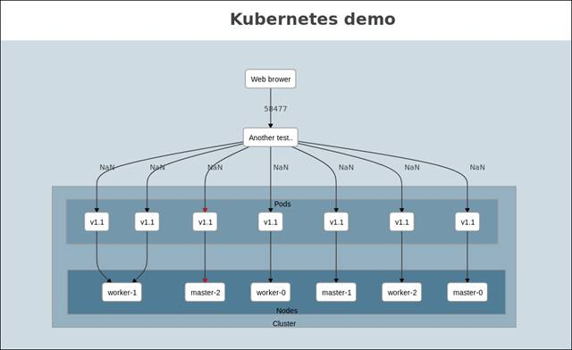

# Deployment demo

A simple application that shows how loadbalacing and deployment works in kubernetes.



It contains of two parts.

- A webserver written in go that publish the enviroment settings as json. It will run as multiple containers in kubernetes.
  ```
  APP_VERSION
  APP_TEXT
  K8S_NODE_NAME
  K8S_POD_NAME
  K8S_POD_NAMESPACE
  K8S_POD_IP
  K8S_HOST_IP
  K8S_POD_SERVICE_ACCOUNT
  ```
  - *The APP_ is set as part of the webserver build.*
  - *The K8S_ is set as part of the deployment.yaml.*
 

- A web client in javascript that collects the json data from the webservers.
  Download **'demo.html'** and adjust the row with 'd3.json' to point to the loadbalanced url


## OpenShift

Create the deployment
```
oc create -f deployment-demo.yaml
```

Create the service
```
oc create -f service-demo.yaml
```

Create the route
```
oc create -f route-demo.yaml
```


## The webserver
The webserver container is automaticlly built and published on dockerhub.

To pull the image:
```
docker pull linuxsmurfen/deployment-demo
```

To run the image:
```
docker run -p 8080:8080 linuxsmurfen/deployment-demo
```
